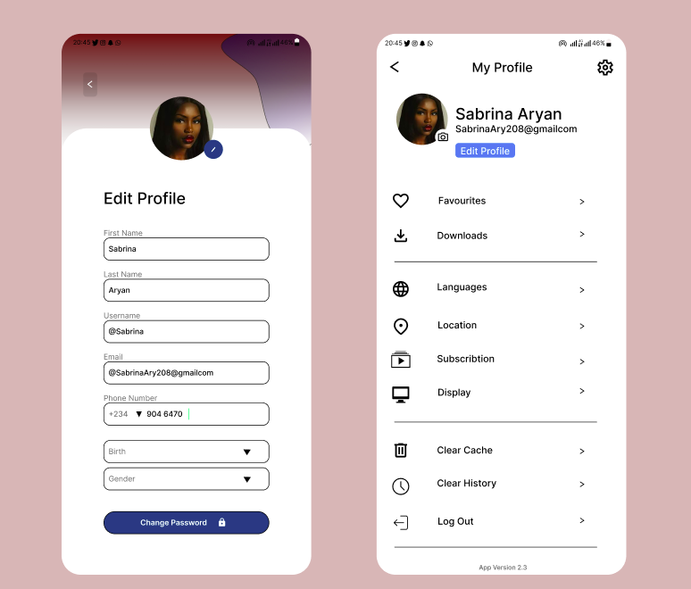

# NTI User Card – Flutter UI Challenge (Day 4)

A Flutter implementation of the user card UI designed in Figma as part of the Day 4 challenge.



## 📌 About

This project recreates the user profile card shown on the **right-hand side** of the Figma design (see image above).


## 🛠️ How to Run
1. **Clone the repository**
   ```bash
   git clone https://github.com/aymanSalahA/nti_user_card.git
